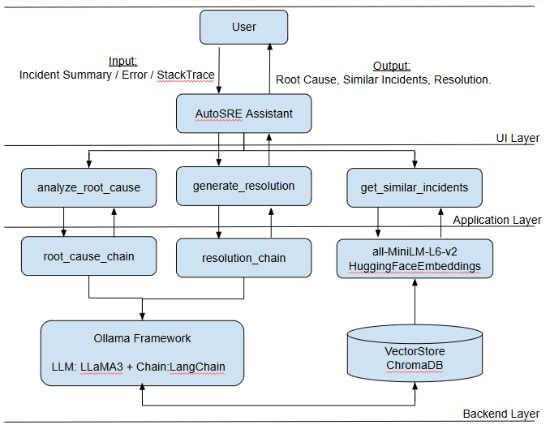

# 🛠️ AutoSRE - Incident Analyzer

**AutoSRE** is an intelligent Site Reliability Engineering (SRE) assistant that helps automate root cause analysis, retrieve similar incidents, and suggest resolution steps — all powered by LLMs and vector search. Built with a modular architecture using Streamlit, LangChain, HuggingFace, ChromaDB, and LLaMA 3 via Ollama.

---

## 🚀 Features

- 🔍 **LLM-Based Root Cause Analysis**
- 📚 **Contextual Similar Incident Retrieval**
- 💡 **Automated Resolution Suggestions**
- ⚡ **Fast Local Inference with Ollama**
- 🧩 **Modular Design with Streamlit UI**

---

## 🎯 Input & Output

- **Input**: Incident Summary / Error / StackTrace
- **Output**: Root Cause, Similar Incidents, Recommended Resolution

---

## 🏗️ Architecture Design

### 1. UI Layer (Frontend)

- **Framework**: Streamlit
- **Responsibilities**:
  - Collect user input
  - Trigger backend logic on button click
  - Display root cause, similar incidents, and resolutions

### 2. Application Layer

- **Chains**:
  - `root_cause_chain`: Summary → Root Cause
  - `responder_chain`: Summary + Root Cause → Resolution
- **Functions**:
  - `analyze_root_cause()`
  - `generate_resolution()`
  - `get_similar_incidents()`

### 3. Backend Layer

- **LLM**: LLaMA 3 via `OllamaLLM`
- **Framework**: LangChain
- **Responsibilities**:
  - Use prompt templates for structured interaction
  - Perform reasoning with LLMs

### 4. Vector Database Layer

- **Embedding Model**: `all-MiniLM-L6-v2` (HuggingFace)
- **Vector Store**: ChromaDB (`data/chroma_db`)
- **Responsibilities**:
  - Embed incident descriptions
  - Perform similarity search over incident history

### 5. Storage Layer

- **Database**: Persistent Chroma DB
- **Stores**: Incident embeddings and metadata

---

## 🔁 Design Flow

1. **User Input** via Streamlit UI
   - Incident summary, error, or stack trace

2. **Root Cause Analysis**
   - LangChain prompt sent to LLaMA 3 using Ollama
   - Returns a probable root cause

3. **Similar Incidents Retrieval**
   - Input embedded via HuggingFace model
   - Query searched in ChromaDB
   - Returns top K matches

4. **Resolution Generation**
   - Prompt combines summary + root cause
   - LLM returns structured resolution steps

5. **Display Results**
   - Shows root cause, related incidents, and resolution steps

---

## ⚙️ Setup Instructions

### 1. Clone the Repository

```bash
git clone https://github.com/your-username/AutoSRE.git
cd AutoSRE
